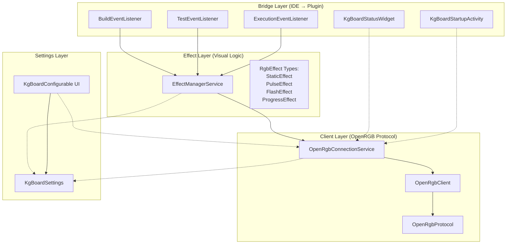
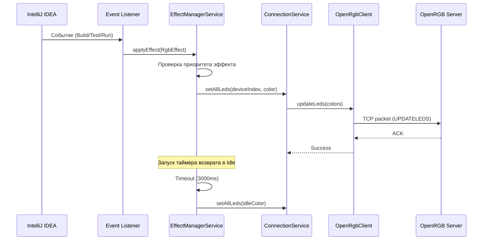

# KGBoard - RGB подсветка клавиатуры для IntelliJ IDEA

## Описание проекта

**KGBoard** - это плагин для IntelliJ IDEA и других IDE на базе IntelliJ Platform, который обеспечивает визуальную обратную связь через RGB подсветку клавиатуры. Плагин отображает различные события IDE (компиляция, тестирование, запуск, отладка) в виде цветовых эффектов на RGB клавиатуре.

### Что умеет плагин

- **Компиляция (Build)**:
  - Желтая пульсация во время компиляции
  - Зеленая вспышка при успешной сборке
  - Красный статический цвет при ошибках сборки
  - Оранжевая вспышка при отмене сборки

- **Тестирование (Testing)**:
  - Синяя пульсация во время запуска тестов
  - Зеленая вспышка при успешном прохождении всех тестов
  - Красный статический цвет при провале тестов

- **Выполнение (Execution)**:
  - Зеленый статический цвет при запуске приложения (Run)
  - Фиолетовая пульсация при отладке (Debug)
  - Оранжевая вспышка при ошибке выполнения (ненулевой exit code)
  - Возврат к цвету покоя при нормальном завершении

- **Статус в реальном времени**:
  - Виджет в статус-баре IDE с индикацией подключения к OpenRGB
  - Автоматическое переподключение при потере соединения
  - Обнаружение всех RGB устройств, подключенных через OpenRGB

### Технологии

- **OpenRGB SDK** - кросс-платформенное управление RGB подсветкой различных производителей
- **Kotlin** - язык разработки плагина
- **IntelliJ Platform SDK** - платформа для создания плагинов
- **TCP Socket** - протокол связи с OpenRGB SDK сервером

---

## Архитектура

### Структура модулей

Плагин организован в несколько логических слоев:



### Поток данных



### Компоненты

#### 1. Bridge Layer (Мост между IDE и плагином)

- **BuildEventListener** - слушает события компиляции (CompilationStatusListener)
- **TestEventListener** - слушает события тестирования (SMTRunnerEventsListener)
- **ExecutionEventListener** - слушает события запуска/отладки (ExecutionListener)
- **KgBoardStartupActivity** - автоподключение к OpenRGB при открытии проекта
- **KgBoardStatusWidget** - виджет в статус-баре с индикацией состояния подключения

#### 2. Effect Layer (Управление визуальными эффектами)

- **EffectManagerService** (Project-level) - оркестрирует эффекты, управляет приоритетами и таймаутами
- **RgbEffect** - абстракция эффекта с приоритетом:
  - `StaticEffect` - статический цвет
  - `PulseEffect` - пульсация (breathing effect)
  - `FlashEffect` - быстрая вспышка с автовозвратом
  - `ProgressEffect` - прогресс-бар (зарезервировано для будущих функций)

#### 3. Client Layer (Связь с OpenRGB)

- **OpenRgbConnectionService** (Application-level) - управление lifecycle подключения, автопереподключение
- **OpenRgbClient** - низкоуровневый TCP клиент для связи с OpenRGB SDK
- **OpenRgbProtocol** - реализация бинарного протокола OpenRGB SDK

#### 4. Settings Layer (Настройки)

- **KgBoardSettings** - хранение и персистентность настроек (kgboard.xml)
- **KgBoardConfigurable** - UI страница настроек в Settings → Tools → KGBoard RGB

---

## Требования

### Системные требования

- **Операционная система**: Ubuntu 20.04+ (или другой Linux дистрибутив с поддержкой OpenRGB)
- **JDK**: Java 21 или выше
- **IntelliJ IDEA**: 2024.3.6 или выше (поддержка до 2025.3.*)
- **OpenRGB**: версия 0.9+ с включенным SDK сервером
- **Права доступа**: udev rules для доступа к USB HID устройствам без sudo

### Совместимые RGB устройства

Плагин работает с любыми RGB устройствами, поддерживаемыми OpenRGB:
- Клавиатуры (Corsair, Razer, Logitech, HyperX, SteelSeries и др.)
- Мыши
- Подсветка корпуса (RGB контроллеры, вентиляторы, LED ленты)
- Оперативная память с RGB
- Материнские платы

Полный список поддерживаемых устройств: https://openrgb.org/devices.html

---

## Установка и настройка OpenRGB на Ubuntu

### 1. Установка OpenRGB

#### Вариант 1: AppImage (рекомендуется)

```bash
# Скачать последнюю версию
wget https://openrgb.org/releases/release_0.9/OpenRGB_0.9_x86_64_b5f46e3.AppImage -O ~/OpenRGB.AppImage

# Сделать исполняемым
chmod +x ~/OpenRGB.AppImage

# Запустить
~/OpenRGB.AppImage
```

#### Вариант 2: Установка из пакета

```bash
# Добавить PPA (для Ubuntu)
sudo add-apt-repository ppa:thopiekar/openrgb
sudo apt update

# Установить OpenRGB
sudo apt install openrgb
```

#### Вариант 3: Сборка из исходников

```bash
# Установить зависимости
sudo apt install build-essential qtbase5-dev libusb-1.0-0-dev libhidapi-dev pkgconf

# Клонировать репозиторий
git clone https://gitlab.com/CalcProgrammer1/OpenRGB.git
cd OpenRGB

# Собрать
qmake OpenRGB.pro
make -j$(nproc)

# Запустить
./openrgb
```

### 2. Настройка udev rules (ОБЯЗАТЕЛЬНО!)

Без udev rules OpenRGB требует запуск с `sudo`, что небезопасно и неудобно.

```bash
# Создать директорию для правил, если её нет
sudo mkdir -p /etc/udev/rules.d

# Скопировать правила из OpenRGB
sudo wget https://openrgb.org/releases/release_0.9/60-openrgb.rules -O /etc/udev/rules.d/60-openrgb.rules

# Или если OpenRGB уже установлен:
sudo cp /usr/share/OpenRGB/60-openrgb.rules /etc/udev/rules.d/

# Перезагрузить udev правила
sudo udevadm control --reload-rules
sudo udevadm trigger

# Добавить текущего пользователя в группу plugdev
sudo usermod -a -G plugdev $USER

# ВАЖНО: Выйти и войти заново, или перезагрузиться
```

После перезагрузки проверьте, что OpenRGB запускается без sudo и видит устройства.

### 3. Включение SDK сервера

KGBoard взаимодействует с OpenRGB через SDK сервер, работающий по TCP на порту 6742.

#### Включение через GUI:

1. Запустить OpenRGB
2. Перейти в **Settings** → **SDK Server**
3. Включить **Enable SDK Server**
4. Порт по умолчанию: `6742` (не менять, если не требуется)
5. Опционально: включить **Auto-start SDK Server** для автозапуска при старте OpenRGB
6. Нажать **Save**

#### Включение через CLI:

```bash
# Запустить OpenRGB в режиме сервера (без GUI)
openrgb --server --server-port 6742

# Или через AppImage
~/OpenRGB.AppImage --server --server-port 6742
```

#### Автозапуск OpenRGB SDK при старте системы (опционально)

Создать systemd service для автозапуска:

```bash
# Создать service file
cat > ~/.config/systemd/user/openrgb.service << 'EOF'
[Unit]
Description=OpenRGB SDK Server
After=graphical-session.target

[Service]
Type=simple
ExecStart=/usr/bin/openrgb --server --server-port 6742
Restart=on-failure

[Install]
WantedBy=default.target
EOF

# Включить и запустить service
systemctl --user enable openrgb.service
systemctl --user start openrgb.service

# Проверить статус
systemctl --user status openrgb.service
```

Если используется AppImage:

```bash
# Заменить ExecStart на:
ExecStart=/home/YOUR_USERNAME/OpenRGB.AppImage --server --server-port 6742
```

### 4. Проверка работы OpenRGB SDK

```bash
# Проверить, что SDK сервер слушает порт 6742
netstat -tulpn | grep 6742

# Или
ss -tlnp | grep 6742

# Должен вывести что-то вроде:
# tcp  0  0  127.0.0.1:6742  0.0.0.0:*  LISTEN  12345/openrgb
```

Если порт не слушается - SDK сервер не запущен. Вернитесь к шагу 3.

---

## Сборка плагина

### Сборка из исходников

```bash
# Перейти в директорию проекта
cd /home/dzerik/Development/KGBoard

# Сборка плагина (создаёт ZIP архив в build/distributions/)
./gradlew buildPlugin

# Результат:
# build/distributions/KGBoard-0.1.0.zip
```

### Запуск IDE с плагином для разработки

```bash
# Запустить IntelliJ IDEA с установленным плагином (для тестирования)
./gradlew runIde

# Откроется новый экземпляр IntelliJ IDEA с активным плагином KGBoard
```

### Другие полезные команды

```bash
# Очистка build артефактов
./gradlew clean

# Проверка плагина на совместимость с Platform API
./gradlew verifyPlugin

# Сборка + проверка
./gradlew buildPlugin verifyPlugin
```

---

## Установка плагина в IDE

### Вариант 1: Установка из ZIP архива (рекомендуется)

1. Собрать плагин (см. раздел "Сборка плагина")
2. Открыть IntelliJ IDEA
3. Перейти в **File → Settings → Plugins**
4. Нажать на иконку шестеренки (⚙️) → **Install Plugin from Disk...**
5. Выбрать файл `build/distributions/KGBoard-0.1.0.zip`
6. Нажать **OK**
7. Перезапустить IDE

### Вариант 2: Запуск через Gradle (для разработки)

```bash
# Запустить sandbox IDE с плагином
./gradlew runIde
```

Этот метод создаёт изолированную среду со всеми настройками в `build/idea-sandbox/`, не затрагивая основную установку IDE.

---

## Настройка плагина

После установки плагин доступен в настройках IDE:

**File → Settings → Tools → KGBoard RGB**

### Секции настроек

#### 1. Общие настройки

| Параметр | Описание | Значение по умолчанию |
|----------|----------|----------------------|
| **Enabled** | Включить/выключить плагин глобально | ✅ Включено |

#### 2. Подключение к OpenRGB

| Параметр | Описание | Значение по умолчанию |
|----------|----------|----------------------|
| **OpenRGB host** | IP адрес или hostname OpenRGB сервера | `127.0.0.1` |
| **OpenRGB port** | TCP порт OpenRGB SDK сервера | `6742` |
| **Device index** | Индекс RGB устройства (0 = первое устройство) | `0` |
| **Auto-reconnect** | Автоматически переподключаться при потере соединения | ✅ Включено |
| **Connect on IDE startup** | Автоматически подключаться при запуске IDE | ✅ Включено |

**Кнопки управления:**
- **Connect** - подключиться к OpenRGB
- **Disconnect** - отключиться от OpenRGB
- **Test LEDs** - проверить подсветку (применить цвет успешной сборки)

**Статус подключения:**
- 🟢 **Connected (N devices)** - успешно подключено, N устройств обнаружено
- 🔴 **Not connected** - нет подключения к OpenRGB

#### 3. Настройки эффектов

| Параметр | Описание | Значение по умолчанию |
|----------|----------|----------------------|
| **Effect duration (ms)** | Длительность временных эффектов (Flash, Pulse) | `3000` мс (3 секунды) |
| **Pulse speed (ms)** | Период пульсации (breathing effect) | `1000` мс (1 секунда) |

#### 4. Цвета событий

Все цвета указываются в формате HEX: `#RRGGBB`

##### Сборка (Build)

| Параметр | Событие | Значение по умолчанию |
|----------|---------|----------------------|
| **Build success color** | Успешная компиляция | `#00C853` (зеленый) |
| **Build failure color** | Ошибки компиляции | `#FF1744` (красный) |
| **Build in progress color** | Процесс компиляции | `#FFD600` (желтый) |

##### Выполнение (Execution)

| Параметр | Событие | Значение по умолчанию |
|----------|---------|----------------------|
| **Run color** | Запуск приложения | `#00E676` (ярко-зеленый) |
| **Debug color** | Режим отладки | `#651FFF` (фиолетовый) |
| **Stop color** | Остановка/ошибка выполнения | `#FF9100` (оранжевый) |

##### Тестирование (Testing)

| Параметр | Событие | Значение по умолчанию |
|----------|---------|----------------------|
| **Test pass color** | Все тесты прошли | `#00C853` (зеленый) |
| **Test fail color** | Тесты провалились | `#FF1744` (красный) |
| **Test running color** | Выполнение тестов | `#2979FF` (синий) |

##### Системные

| Параметр | Описание | Значение по умолчанию |
|----------|----------|----------------------|
| **Idle color** | Цвет покоя (нет активности) | `#263238` (темно-серый) |

---

## Маппинг событий на RGB эффекты

### Таблица событий

| Событие IDE | Тип эффекта | Цвет по умолчанию | Приоритет | Длительность | Описание |
|-------------|-------------|-------------------|-----------|--------------|----------|
| **Build: started** | `PulseEffect` | `#FFD600` (желтый) | 5 | До завершения | Пульсация во время компиляции |
| **Build: success** | `FlashEffect` | `#00C853` (зеленый) | 7 | 2000 мс | Быстрая вспышка при успехе |
| **Build: failure** | `StaticEffect` | `#FF1744` (красный) | 9 | 3000 мс | Статический красный при ошибках |
| **Build: aborted** | `FlashEffect` | `#FF9100` (оранжевый) | 8 | 1000 мс | Вспышка при отмене сборки |
| **Test: started** | `PulseEffect` | `#2979FF` (синий) | 6 | До завершения | Синяя пульсация при тестировании |
| **Test: all passed** | `FlashEffect` | `#00C853` (зеленый) | 7 | 2000 мс | Зеленая вспышка при успехе |
| **Test: failed** | `StaticEffect` | `#FF1744` (красный) | 8 | 3000 мс | Красный при провале тестов |
| **Run: started** | `StaticEffect` | `#00E676` (ярко-зеленый) | 4 | До завершения | Статический зеленый при запуске |
| **Run: terminated (exit=0)** | Idle | `#263238` (темно-серый) | 0 | Постоянно | Возврат к цвету покоя |
| **Run: terminated (exit≠0)** | `FlashEffect` | `#FF9100` (оранжевый) | 7 | 1500 мс | Оранжевая вспышка при ошибке |
| **Debug: started** | `PulseEffect` | `#651FFF` (фиолетовый) | 6 | До завершения | Фиолетовая пульсация при отладке |
| **Debug: terminated** | Idle | `#263238` (темно-серый) | 0 | Постоянно | Возврат к цвету покоя |
| **Idle (no events)** | `StaticEffect` | `#263238` (темно-серый) | 0 | Постоянно | Цвет по умолчанию |

### Система приоритетов

Эффекты имеют приоритеты (0-10, где 10 = наивысший). Если активен эффект с приоритетом N, эффекты с приоритетом ниже N игнорируются.

**Приоритеты по убыванию:**
1. **Build failure** (9) - критическая ошибка сборки
2. **Build aborted** (8) - прерванная сборка
3. **Test failed** (8) - провалившиеся тесты
4. **Build success / Test pass / Process error** (7) - завершающие события
5. **Debug / Test running** (6) - процессы с высоким приоритетом
6. **Build in progress** (5) - процесс компиляции
7. **Run** (4) - обычное выполнение
8. **Idle** (0) - базовое состояние

**Пример:**
- Во время отладки (Debug, приоритет 6) запускается сборка (Build in progress, приоритет 5)
- Фиолетовая пульсация отладки продолжается (6 > 5)
- Если сборка провалится (Build failure, приоритет 9), включится красный цвет (9 > 6)

---

## Кастомизация цветов

### Формат HEX

Все цвета указываются в шестнадцатеричном формате: `#RRGGBB`

- `#FF0000` - красный
- `#00FF00` - зеленый
- `#0000FF` - синий
- `#FFFFFF` - белый
- `#000000` - черный
- `#FFD600` - желтый
- `#651FFF` - фиолетовый

### Список всех настраиваемых цветов

| Параметр в настройках | Ключ в `kgboard.xml` | По умолчанию | Применение |
|-----------------------|----------------------|--------------|------------|
| Build success color | `buildSuccessColor` | `#00C853` | Успешная сборка |
| Build failure color | `buildFailureColor` | `#FF1744` | Ошибка сборки |
| Build in progress color | `buildInProgressColor` | `#FFD600` | Процесс сборки |
| Run color | `runColor` | `#00E676` | Запуск приложения |
| Debug color | `debugColor` | `#651FFF` | Режим отладки |
| Stop color | `stopColor` | `#FF9100` | Остановка/ошибка |
| Test pass color | `testPassColor` | `#00C853` | Тесты пройдены |
| Test fail color | `testFailColor` | `#FF1744` | Тесты провалены |
| Test running color | `testRunningColor` | `#2979FF` | Выполнение тестов |
| Idle color | `idleColor` | `#263238` | Цвет покоя |

### Ручное редактирование конфигурации

Настройки хранятся в файле: `~/.config/JetBrains/IntelliJIdea<VERSION>/options/kgboard.xml`

Пример содержимого:

```xml
<application>
  <component name="KgBoardSettings">
    <option name="host" value="127.0.0.1" />
    <option name="port" value="6742" />
    <option name="deviceIndex" value="0" />
    <option name="enabled" value="true" />
    <option name="autoReconnect" value="true" />
    <option name="autoConnect" value="true" />
    <option name="buildSuccessColor" value="#00C853" />
    <option name="buildFailureColor" value="#FF1744" />
    <option name="buildInProgressColor" value="#FFD600" />
    <option name="runColor" value="#00E676" />
    <option name="debugColor" value="#651FFF" />
    <option name="stopColor" value="#FF9100" />
    <option name="testPassColor" value="#00C853" />
    <option name="testFailColor" value="#FF1744" />
    <option name="testRunningColor" value="#2979FF" />
    <option name="effectDurationMs" value="3000" />
    <option name="pulseSpeedMs" value="1000" />
    <option name="idleColor" value="#263238" />
  </component>
</application>
```

---

## Troubleshooting (Решение проблем)

### 1. Плагин не подключается к OpenRGB

**Симптомы:**
- Статус виджет показывает "RGB: OFF"
- В настройках статус "Not connected"

**Причины и решения:**

#### a) OpenRGB SDK сервер не запущен

```bash
# Проверить, запущен ли OpenRGB
ps aux | grep openrgb

# Проверить, слушается ли порт 6742
netstat -tlnp | grep 6742
```

**Решение:**
```bash
# Запустить OpenRGB с SDK сервером
openrgb --server --server-port 6742
```

#### b) Неправильный хост или порт

**Решение:**
- Открыть **Settings → Tools → KGBoard RGB**
- Проверить **OpenRGB host**: должен быть `127.0.0.1` (если OpenRGB на той же машине)
- Проверить **OpenRGB port**: должен быть `6742`
- Нажать **Connect**

#### c) Firewall блокирует подключение

```bash
# Проверить правила firewall
sudo ufw status

# Разрешить локальные подключения (если нужно)
sudo ufw allow from 127.0.0.1 to any port 6742
```

### 2. OpenRGB не видит устройства

**Симптомы:**
- OpenRGB запускается, но показывает 0 устройств
- Требует запуск через `sudo`

**Причины и решения:**

#### a) Не настроены udev rules

**Решение:** См. раздел "Настройка udev rules"

```bash
# Скачать и установить правила
sudo wget https://openrgb.org/releases/release_0.9/60-openrgb.rules -O /etc/udev/rules.d/60-openrgb.rules

# Перезагрузить udev
sudo udevadm control --reload-rules
sudo udevadm trigger

# Добавить пользователя в группу
sudo usermod -a -G plugdev $USER

# ОБЯЗАТЕЛЬНО: выйти и войти заново или перезагрузиться
```

#### b) Устройство не поддерживается OpenRGB

Проверить список поддерживаемых устройств: https://openrgb.org/devices.html

### 3. Permission denied при запуске OpenRGB

**Ошибка:**
```
Error: Failed to open device: Permission denied
```

**Причина:** Нет прав доступа к USB HID устройствам.

**Решение:**
```bash
# Установить udev rules (см. выше)
sudo cp /usr/share/OpenRGB/60-openrgb.rules /etc/udev/rules.d/
sudo udevadm control --reload-rules
sudo udevadm trigger

# Добавить в группу plugdev
sudo usermod -a -G plugdev $USER

# Перезагрузиться
sudo reboot
```

### 4. Эффекты не применяются

**Симптомы:**
- Плагин подключен к OpenRGB
- Статус виджет показывает "RGB: ON (N devices)"
- Но при событиях (сборка, тесты) подсветка не меняется

**Причины и решения:**

#### a) Плагин отключен

**Решение:**
- Открыть **Settings → Tools → KGBoard RGB**
- Убедиться, что галочка **Enabled** установлена

#### b) Неправильный Device Index

Если у вас несколько RGB устройств, нужно выбрать правильный индекс.

**Решение:**
- Открыть OpenRGB GUI
- Посмотреть порядок устройств (0 = первое, 1 = второе и т.д.)
- Открыть **Settings → Tools → KGBoard RGB**
- Установить правильный **Device index**
- Нажать **Test LEDs** для проверки

#### c) Устройство находится в режиме Hardware Control

Некоторые устройства имеют аппаратный режим управления, который блокирует изменения через SDK.

**Решение:**
- Открыть OpenRGB GUI
- Выбрать устройство
- Переключить режим на **Direct** или **Custom**
- Попробовать снова

### 5. Высокая нагрузка на CPU

**Симптомы:**
- Процесс `java` или IDE потребляет много CPU при активных эффектах

**Причины:**
- Анимационные эффекты (Pulse) обновляют подсветку 30-60 раз в секунду

**Решение:**
- Увеличить значение **Pulse speed (ms)** в настройках (например, с 1000 до 2000)
- Использовать Static эффекты вместо Pulse (изменить логику в коде)

### 6. Плагин не загружается после установки

**Симптомы:**
- Плагин установлен, но не появляется в списке плагинов
- Нет настроек **Tools → KGBoard RGB**

**Причины и решения:**

#### a) Несовместимая версия IDE

Плагин требует IntelliJ IDEA 2024.3+ (build 243+).

**Решение:**
- Обновить IDE до версии 2024.3.6 или выше
- Или пересобрать плагин с изменением `pluginSinceBuild` в `gradle.properties`

#### b) Конфликт с другим плагином

**Решение:**
- Открыть **Help → Show Log in Explorer**
- Посмотреть `idea.log` на предмет ошибок загрузки плагина
- Отключить другие RGB/подсветка плагины (если есть)

### 7. Логирование для диагностики

Включить отладочные логи плагина:

1. Открыть **Help → Diagnostic Tools → Debug Log Settings**
2. Добавить строку: `#com.kgboard.rgb`
3. Нажать **OK**
4. Воспроизвести проблему
5. Открыть **Help → Show Log in Explorer**
6. Изучить `idea.log`

Логи показывают:
- Попытки подключения к OpenRGB
- Обнаруженные устройства
- Применяемые эффекты
- Ошибки сетевого взаимодействия

---

## Разработка

Информация для разработчиков, желающих доработать плагин.

### Структура проекта

```
KGBoard/
├── src/main/
│   ├── kotlin/com/kgboard/rgb/
│   │   ├── bridge/          # IDE listeners и UI компоненты
│   │   │   ├── BuildEventListener.kt
│   │   │   ├── TestEventListener.kt
│   │   │   ├── ExecutionEventListener.kt
│   │   │   ├── KgBoardStartupActivity.kt
│   │   │   └── KgBoardStatusWidgetFactory.kt
│   │   ├── client/          # OpenRGB SDK клиент
│   │   │   ├── OpenRgbClient.kt
│   │   │   ├── OpenRgbConnectionService.kt
│   │   │   └── OpenRgbProtocol.kt
│   │   ├── effect/          # Визуальные эффекты
│   │   │   ├── RgbEffect.kt
│   │   │   └── EffectManagerService.kt
│   │   └── settings/        # Настройки плагина
│   │       ├── KgBoardSettings.kt
│   │       └── KgBoardConfigurable.kt
│   └── resources/
│       └── META-INF/
│           └── plugin.xml   # Манифест плагина
├── build.gradle.kts         # Gradle конфигурация
└── gradle.properties        # Версии и параметры
```

### Как добавить новый RGB эффект

1. **Создать класс эффекта** в `effect/RgbEffect.kt`:

```kotlin
class BlinkEffect(
    val color: Color,
    val onDurationMs: Long = 200,
    val offDurationMs: Long = 200,
    val times: Int = 3,
    override val name: String = "blink",
    priority: Int = 0
) : RgbEffect(priority)
```

2. **Реализовать логику** в `EffectManagerService.kt`:

```kotlin
fun applyEffect(effect: RgbEffect, timeoutMs: Long? = null) {
    // ...
    when (effect) {
        is StaticEffect -> applyStatic(effect)
        is PulseEffect -> applyPulse(effect)
        is FlashEffect -> applyFlash(effect)
        is ProgressEffect -> applyProgress(effect)
        is BlinkEffect -> applyBlink(effect)  // <-- Добавить
    }
    // ...
}

private fun applyBlink(effect: BlinkEffect) {
    var count = 0
    animationTask = scheduler.scheduleAtFixedRate({
        try {
            val color = if (count % 2 == 0) effect.color else Color.BLACK
            setAllLeds(color)
            count++
            if (count >= effect.times * 2) {
                animationTask?.cancel(false)
                returnToIdle()
            }
        } catch (e: Exception) {
            log.warn("Blink effect error: ${e.message}")
        }
    }, 0, effect.onDurationMs, TimeUnit.MILLISECONDS)
}
```

3. **Использовать** в любом Listener:

```kotlin
effectManager.applyEffect(
    BlinkEffect(
        color = Color.CYAN,
        times = 5,
        priority = 7
    )
)
```

### Как добавить новый Event Listener

1. **Создать listener класс** в `bridge/`:

```kotlin
package com.kgboard.rgb.bridge

import com.intellij.openapi.project.Project
import com.intellij.openapi.vcs.CheckinProjectPanel
import com.intellij.openapi.vcs.changes.CommitContext
import com.intellij.openapi.vcs.checkin.CheckinHandler
import com.intellij.openapi.vcs.checkin.CheckinHandlerFactory
import com.kgboard.rgb.effect.EffectManagerService
import com.kgboard.rgb.effect.FlashEffect
import com.kgboard.rgb.settings.KgBoardSettings

/**
 * Пример: подсветка при VCS commit
 */
class VcsCommitListener : CheckinHandlerFactory() {
    override fun createHandler(panel: CheckinProjectPanel, commitContext: CommitContext): CheckinHandler {
        return object : CheckinHandler() {
            override fun checkinSuccessful() {
                val project = panel.project
                val settings = KgBoardSettings.getInstance()
                if (!settings.enabled) return

                EffectManagerService.getInstance(project).applyTemporary(
                    FlashEffect(
                        color = Color.CYAN,
                        durationMs = 1000,
                        name = "vcs-commit",
                        priority = 6
                    )
                )
            }
        }
    }
}
```

2. **Зарегистрировать** в `plugin.xml`:

```xml
<extensions defaultExtensionNs="com.intellij">
    <!-- Existing extensions... -->
    <checkinHandlerFactory
        implementation="com.kgboard.rgb.bridge.VcsCommitListener"/>
</extensions>
```

3. **Опционально**: добавить настройку цвета в `KgBoardSettings.kt` и UI в `KgBoardConfigurable.kt`.

### Как добавить настройку

1. **Добавить поле** в `KgBoardSettings.State`:

```kotlin
data class State(
    // ... existing fields ...
    var vcsCommitColor: String = "#00BCD4"
)
```

2. **Добавить accessor**:

```kotlin
val vcsCommitColor: Color get() = parseColor(state.vcsCommitColor)
```

3. **Добавить UI поле** в `KgBoardConfigurable.kt`:

```kotlin
private var vcsCommitField: JBTextField? = null

override fun createComponent(): JComponent {
    // ...
    vcsCommitField = JBTextField(8)

    return FormBuilder.createFormBuilder()
        // ... existing fields ...
        .addLabeledComponent(JBLabel("VCS commit color:"), vcsCommitField!!)
        .panel
}

override fun isModified(): Boolean {
    val s = KgBoardSettings.getInstance()
    return // ... existing checks ... ||
           vcsCommitField?.text != s.state.vcsCommitColor
}

override fun apply() {
    val s = KgBoardSettings.getInstance()
    // ...
    s.state.vcsCommitColor = vcsCommitField?.text ?: s.state.vcsCommitColor
}

override fun reset() {
    val s = KgBoardSettings.getInstance()
    // ...
    vcsCommitField?.text = s.state.vcsCommitColor
}
```

### Полезные ссылки для разработки

- **IntelliJ Platform SDK Docs**: https://plugins.jetbrains.com/docs/intellij/welcome.html
- **OpenRGB SDK Protocol**: https://gitlab.com/OpenRGBDevelopers/OpenRGB-Wiki/-/blob/stable/Developer-Documentation/OpenRGB-SDK-Documentation.md
- **IntelliJ Platform Explorer**: https://plugins.jetbrains.com/intellij-platform-explorer/
- **Extension Points List**: https://plugins.jetbrains.com/docs/intellij/extension-point-list.html

### Отладка плагина

```bash
# Запустить IDE с отладчиком (порт 5005)
./gradlew runIde --debug-jvm

# В другом окне:
# 1. Открыть проект в IntelliJ IDEA
# 2. Run → Edit Configurations → + → Remote JVM Debug
# 3. Host: localhost, Port: 5005
# 4. Run → Debug 'Remote Debug'
```

Теперь можно ставить breakpoints в коде плагина.

---

## Лицензия

Проект распространяется как open source. Проверьте файл LICENSE в корне репозитория для деталей.

---

## Авторы

**KGBoard** - RGB подсветка для IntelliJ IDEA

Разработано как экспериментальный проект для интеграции RGB периферии с инструментами разработки.

---

## Поддержка и обратная связь

Для сообщения об ошибках, предложений или вопросов:
- Создавайте Issues в репозитории проекта
- Проверяйте раздел Troubleshooting перед обращением

---

**Версия документации:** 1.0
**Версия плагина:** 0.1.0
**Дата обновления:** 2026-02-12
